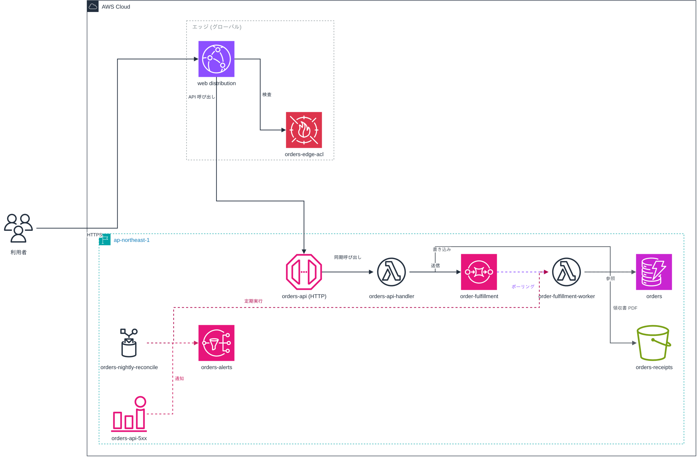

# aws-infra-drawio

Terraform から AWS のインフラ構成図 (`.drawio`) を作る Claude Code プラグイン。
draw.io 公式の MCP サーバー ([`@drawio/mcp`](https://github.com/jgraph/drawio-mcp)) をラップし、図のデータを外へ出さずに手元で完結させる。

## 何をするか

構成図の情報を 3 層に分け、層ごとに管理者を変える。

| 層 | ファイル | 管理者 |
|---|---|---|
| 構造 | `structure.yaml` | 人間がレビューする。AI が IaC から抽出して提案する |
| 規約 | `conventions.md` / `layout.yaml` | 人間が決める。AI が決定を追記して蓄積する |
| 見た目・座標 | `*.drawio` | スクリプトが生成する |

座標を AI に描かせないので、同じ `structure.yaml` からは必ず同じ `.drawio` が出る。
図の差分が構成の差分と一致するため、PR でレビューできる。

この分け方は [ZOZO の記事](https://techblog.zozo.com/entry/architecture-diagram-with-claude-code) の設計を踏襲している。
記事はレンダラに D2 を使っているが、こちらは draw.io を使い、AWS 公式アイコンで描く。

## セットアップ

たまにしか使わないなら、インストールせず npx で起動する。

```bash
npx aws-infra-drawio claude   # このプラグインを読み込んだ Claude Code が起動する
```

`drawio` という名前で MCP サーバーが登録され、`/aws-infra-drawio:aws-diagram` スキルが使えるようになる。
セッションを閉じれば元の状態に戻り、手元には npx のキャッシュしか残らない。

コマンド単体も npx から呼べる。

```bash
npx aws-infra-drawio validate <dir>/structure.yaml
npx aws-infra-drawio render   <dir>/structure.yaml --route
npx aws-infra-drawio check    <dir>/structure.yaml
npx aws-infra-drawio export   <dir>/<view>.drawio png 1.5
npx aws-infra-drawio help
```

### 常用するなら

プラグインとして常に入れておく場合は marketplace 経由でインストールする。`marketplace.json` に npm を source として書ける。

```json
{
  "name": "aws-infra-drawio",
  "source": { "source": "npm", "package": "aws-infra-drawio" }
}
```

### 開発するなら

```bash
git clone https://github.com/tanabe1478/aws-infra-drawio-integration-plugin.git
cd aws-infra-drawio-integration-plugin
bash scripts/setup.sh          # 依存の導入と shape インデックスの配置
claude --plugin-dir .
```

### ローカル完結について

ネットワークへ出るのはパッケージの取得 (npx / npm install) だけ。shape インデックスはパッケージに同梱しているので、
git clone して `setup.sh` を使う場合を除き別途の取得もいらない。それ以降は次のとおり。

| 機能 | 通信 |
|---|---|
| `.drawio` の生成 | なし |
| PNG / SVG 書き出し | なし (drawio-desktop か Docker イメージをローカルで実行) |
| `search_shapes` (アイコン検索) | なし (`setup.sh` がインデックスをローカルへ配置する) |
| `open_drawio_xml` (エディタで開く) | `DRAWIO_BASE_URL` の指す先。既定は `http://localhost:8080/` |
| `--route` (経路の最適化) | 初回のみ CDN へ条件付き GET を試み、失敗時は同梱コピーを使う |

エディタをローカルで動かす場合は次を実行する。

```bash
bash scripts/setup.sh --serve   # jgraph/drawio を localhost:8080 で起動
bash scripts/setup.sh --status  # 状態を確認
```

図のデータは URL の `#fragment` に載るため、`DRAWIO_BASE_URL` が外部を指していてもサーバーへは送信されない。
それでも外部へ一切アクセスさせたくない場合はセルフホストを使う。

## 使い方

Claude Code で次のように頼む。

```
/aws-infra-drawio:aws-diagram infra/ の Terraform から API の構成図を作って
```

スキルが IaC を読み、`structure.yaml` を提案し、レビュー後に `.drawio` と PNG を生成する。

手で回す場合は次のとおり。

```bash
node scripts/validate-structure.mjs <dir>/structure.yaml   # 構造の検証
node scripts/render-drawio.mjs      <dir>/structure.yaml --route
node scripts/check-geometry.mjs     <dir>/structure.yaml   # 枠のはみ出し・重なりの検査
bash scripts/export-drawio.sh       <dir>/<view>.drawio png 1.5
```

## 例

`examples/serverless-api/` に Terraform と、そこから起こした `structure.yaml`、生成物一式がある。



## 仕組み

| ファイル | 役割 |
|---|---|
| `skills/aws-diagram/` | Claude Code のスキル。ワークフローと規約 |
| `scripts/lib/layout.mjs` | 座標の決定。列 = 流れ、行 = 所属コンテナ |
| `scripts/lib/containers.mjs` | AWS Cloud / Region / VPC / サブネットなどの枠の定義 |
| `scripts/shape-map.json` | CloudFormation 型 → AWS アイコンの style。draw.io の shape インデックスから機械生成 |
| `scripts/lib/route.mjs` | `@drawio/mcp` 同梱の libavoid で障害物を避ける経路を焼き込む |
| `vendor/search-index.json` | draw.io の shape インデックス (約 10,000 件) |

アイコン名 (`mxgraph.aws4.*`) は手で書かず、`npm run gen:shape-map` で公式インデックスから解決する。
未対応のリソース型は MCP の `search_shapes` で引いて `structure.yaml` の `style:` に貼れる。

## 検査

```bash
bash scripts/selftest.sh
```

shape-map の一致、例の検証、幾何の健全性、描画の決定性を確認する。

## 制限

- レイアウトは列 (流れ) と行 (所属) の単純な規則で決めている。星形の構成 (1 つの Lambda に多数がぶら下がる) では縦に伸びやすい。`column` で列を固定して調整する
- エッジのラベルは始点寄りに置く。線が長く迂回する構成では、それでも読みにくい位置に来ることがある
- 入力は Terraform を想定している。CDK / CloudFormation は `structure-spec.md` の対応表を足せば使える
